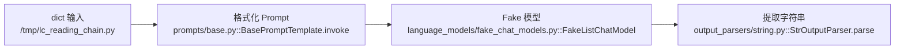

# 01. 本地运行与调试

## 1. 开发环境模型

这个仓库不是“根目录一个 Python 项目”，而是多个独立版本、各自拥有 `pyproject.toml` 和 `uv.lock` 的包。最稳妥的做法是：**进入正在学习的包目录，再执行 `uv sync` 和 `uv run`**。

```text
仓库根目录
├── libs/core             # langchain-core，第一学习环境
├── libs/langchain_v1     # langchain，新版 Agent
└── libs/partners/openai  # langchain-openai，真实厂商实现
```

依据：

- [`libs/core/pyproject.toml`](../libs/core/pyproject.toml)
- [`libs/langchain_v1/pyproject.toml`](../libs/langchain_v1/pyproject.toml)
- [`libs/partners/openai/pyproject.toml`](../libs/partners/openai/pyproject.toml)

三个包都要求 Python `>=3.10,<4.0`。本次生成文档时，本机为 Python 3.13.13，但 `uv` 尚未安装，因此下面命令来自仓库配置与 Makefile，需在安装 `uv` 后执行。

## 2. 准备工具

需要：

- Git 完整克隆的本仓库；
- Python 3.10～3.14 中任一受支持版本；
- `uv`；
- 推荐 VS Code + Python、Ruff、Mypy、Markdown Mermaid 扩展。仓库推荐扩展见 [`.vscode/extensions.json`](../.vscode/extensions.json)。

安装好 `uv` 后先检查：

```bash
uv --version
python3 --version
```

不要手动创建或激活临时 venv，也不要直接用 `pip`、Poetry、Conda 安装本仓库依赖；仓库开发约定统一由 `uv` 管理解释器和 `.venv`。

## 3. 创建第一个源码环境：langchain-core

```bash
cd libs/core
uv sync --all-groups
uv run python -c "import langchain_core; print(langchain_core.__version__)"
```

`uv sync --all-groups` 会按 [`libs/core/pyproject.toml`](../libs/core/pyproject.toml) 和锁文件创建/更新 `libs/core/.venv`。以后运行 Python、pytest、ruff 都通过 `uv run`，无需 `source .venv/bin/activate`。

如果只想跑测试，减少安装内容：

```bash
cd libs/core
uv sync --group test
```

## 4. 运行最小、无网络的 Chain

在 `libs/core` 下新建临时学习脚本（不要放进正式包目录），例如 `/tmp/lc_reading_chain.py`：

```python
from langchain_core.language_models.fake_chat_models import FakeListChatModel
from langchain_core.output_parsers import StrOutputParser
from langchain_core.prompts import ChatPromptTemplate

prompt = ChatPromptTemplate.from_messages(
    [
        ("system", "你是一位 Python 老师。"),
        ("human", "用一句话解释 {topic}"),
    ]
)
model = FakeListChatModel(responses=["Runnable 是 LangChain 的统一执行协议。"])
chain = prompt | model | StrOutputParser()

print(type(chain).__name__)
print(chain.invoke({"topic": "Runnable"}))
```

运行：

```bash
cd libs/core
uv run python /tmp/lc_reading_chain.py
```

该脚本不访问模型 API，适合作为第一条断点链路。真实经过：



源码入口：

- [`BasePromptTemplate.invoke`](../libs/core/langchain_core/prompts/base.py)
- [`FakeListChatModel`](../libs/core/langchain_core/language_models/fake_chat_models.py)
- [`StrOutputParser`](../libs/core/langchain_core/output_parsers/string.py)
- [`RunnableSequence.invoke`](../libs/core/langchain_core/runnables/base.py)

## 5. 运行单元测试

先跑一个小文件，不要一开始跑全部测试：

```bash
cd libs/core
uv run --group test pytest \
  tests/unit_tests/runnables/test_runnable.py \
  -x -vv --disable-socket --allow-unix-socket
```

根据本地源码选择测试时，可先搜索：

```bash
rg -n "class RunnableSequence|def test_.*sequence" \
  langchain_core tests/unit_tests
```

仓库封装命令：

```bash
cd libs/core
make help
make test TEST_FILE=tests/unit_tests/runnables/test_runnable.py
make lint
make type
```

`make test` 会主动移除 LangSmith/Tracing 环境变量并禁用网络，定义见 [`libs/core/Makefile`](../libs/core/Makefile)。这保证单元测试不会意外发请求或上传 trace。

## 6. 调试新版 langchain Agent

新版 `langchain` 的依赖通过本地 editable source 指向 `../core`，见 [`libs/langchain_v1/pyproject.toml`](../libs/langchain_v1/pyproject.toml) 的 `[tool.uv.sources]`。因此修改 core 源码后，不需要重新打 wheel。

```bash
cd libs/langchain_v1
uv sync --all-groups
uv run python -c "from langchain.agents import create_agent; print(create_agent)"
```

只跑 Agent 快速测试：

```bash
cd libs/langchain_v1
uv run --group test pytest \
  tests/unit_tests/agents/test_return_direct_graph.py \
  -x -vv --benchmark-disable --disable-socket --allow-unix-socket
```

实际文件名可能随源码演进变化，先用下面命令确认：

```bash
rg --files tests/unit_tests/agents | sort
rg -n "def test_.*tool|create_agent" tests/unit_tests/agents
```

`make test_fast` 使用内存服务；完整 `make test` 会通过 Docker Compose 启动 PostgreSQL/Redis。新手应先跑单文件或 `make test_fast`，命令定义见 [`libs/langchain_v1/Makefile`](../libs/langchain_v1/Makefile)。

## 7. 调试 OpenAI 适配层

```bash
cd libs/partners/openai
uv sync --all-groups
uv run python -c "from langchain_openai import ChatOpenAI; print(ChatOpenAI)"
```

优先运行 mock/VCR 单元测试，不需要 API Key：

```bash
cd libs/partners/openai
uv run --group test pytest \
  tests/unit_tests/chat_models/test_base.py \
  -x -vv --disable-socket --allow-unix-socket
```

集成测试可能使用网络、消耗额度或需要 `OPENAI_API_KEY`。只有明确要验证真实 API 时再运行：

```bash
cd libs/partners/openai
uv run --group test --group test_integration pytest \
  tests/integration_tests/chat_models \
  -x -vv
```

不要把 Key 写进脚本、文档、测试 fixture 或提交记录；只通过本地环境变量注入。

## 8. 三种推荐断点方法

### 方法 A：内置 `breakpoint()`

临时在你自己的 `/tmp/lc_reading_chain.py` 中加：

```python
breakpoint()
result = chain.invoke({"topic": "Runnable"})
```

Pdb 常用命令：

| 命令 | 含义 |
|---|---|
| `n` | 执行当前行，不进入函数 |
| `s` | 进入当前函数 |
| `r` | 执行到当前函数返回 |
| `p expr` | 打印表达式 |
| `pp expr` | 美化打印 |
| `where` | 查看调用栈 |
| `up` / `down` | 在调用栈上下移动 |
| `c` | 继续到下一个断点 |
| `q` | 退出 |

### 方法 B：pytest 失败即进入调试

```bash
uv run --group test pytest path/to/test_file.py::test_name \
  -x -vv --pdb --tb=short
```

也可以在测试或源码临时加 `breakpoint()`，用 `-s` 关闭输出捕获：

```bash
uv run --group test pytest path/to/test_file.py::test_name -x -vv -s
```

### 方法 C：VS Code 单步

1. 用仓库根目录打开 VS Code。
2. 选择目标包的解释器，例如 `libs/core/.venv/bin/python`。
3. 打开 `/tmp` 脚本不便于 workspace 调试时，可在仓库根目录自建被 `.gitignore` 忽略的个人 scratch 文件，或使用 VS Code “Python: Current File”。
4. 在下列函数上设断点：
   - [`RunnableSequence.invoke`](../libs/core/langchain_core/runnables/base.py)
   - [`BasePromptTemplate.invoke`](../libs/core/langchain_core/prompts/base.py)
   - [`BaseChatModel.invoke`](../libs/core/langchain_core/language_models/chat_models.py)
   - [`BaseOutputParser.invoke`](../libs/core/langchain_core/output_parsers/base.py)

仓库已配置 `python.analysis.include = ["libs/**"]`，见 [`.vscode/settings.json`](../.vscode/settings.json)。如果自动跳到 PyPI 安装版本而不是本地源码，通常是选错了解释器，或没有从目标包目录执行 `uv sync`。

## 9. 推荐的单步顺序

先只调同步 `invoke`：

```text
RunnableSequence.invoke
  -> BasePromptTemplate.invoke
  -> BaseChatModel.invoke
  -> FakeListChatModel._generate
  -> BaseOutputParser.invoke
  -> StrOutputParser.parse
```

第二遍再调真实 OpenAI：

```text
BaseChatModel.invoke
  -> BaseChatModel.generate_prompt / generate
  -> BaseChatModel._generate_with_cache
  -> BaseChatOpenAI._generate
  -> BaseChatOpenAI._get_request_payload
  -> OpenAI Python SDK client.create
  -> BaseChatOpenAI._create_chat_result
```

第三遍才看异步和流式：`ainvoke -> agenerate -> _agenerate`，`stream -> _stream -> ChatGenerationChunk`。

## 10. 常见故障

| 现象 | 原因 | 排查 |
|---|---|---|
| `uv: command not found` | 未安装或 PATH 未刷新 | 安装 `uv`，重开终端，运行 `uv --version` |
| 导入的是 site-packages | VS Code/终端解释器不是包内 `.venv` | `uv run python -c "import langchain_core; print(langchain_core.__file__)"` |
| `ModuleNotFoundError: langchain` | 只同步了 core，却运行新版包代码 | 进入 `libs/langchain_v1` 后 `uv sync` |
| 测试意外联网 | 直接运行了集成测试或漏掉 socket 限制 | 先用 `tests/unit_tests` 和 Makefile 的 test 命令 |
| Agent 测试需要 Redis/Postgres | 跑了完整/extended 测试 | 先跑单文件或 `make test_fast` |
| 断点进不了 `_generate` | 命中缓存或走了 streaming 分支 | 关闭缓存，检查 `_generate_with_cache` 的分支条件 |
| Mermaid 不显示 | Markdown 预览器不支持 | 安装仓库推荐的 Markdown Mermaid 扩展 |

## 11. 验证环境的检查清单

- [ ] `uv --version` 成功。
- [ ] 在 `libs/core` 执行 `uv sync --all-groups` 成功。
- [ ] `langchain_core.__file__` 指向本仓库 `libs/core/langchain_core`。
- [ ] 最小 Fake Model Chain 输出结果。
- [ ] 一个 runnable 单元测试通过。
- [ ] 能在 `RunnableSequence.invoke` 命中断点并看到 `self.steps`。
