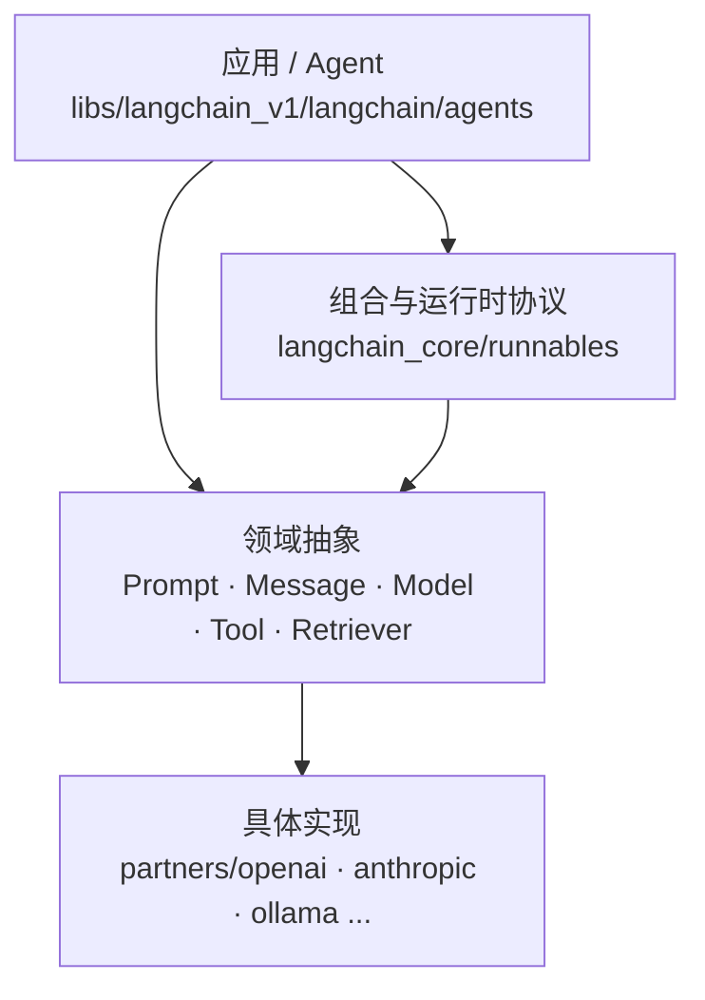
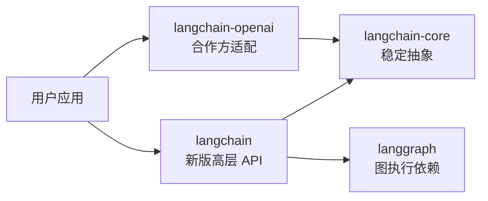
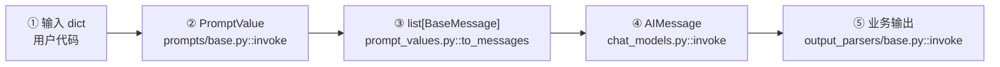
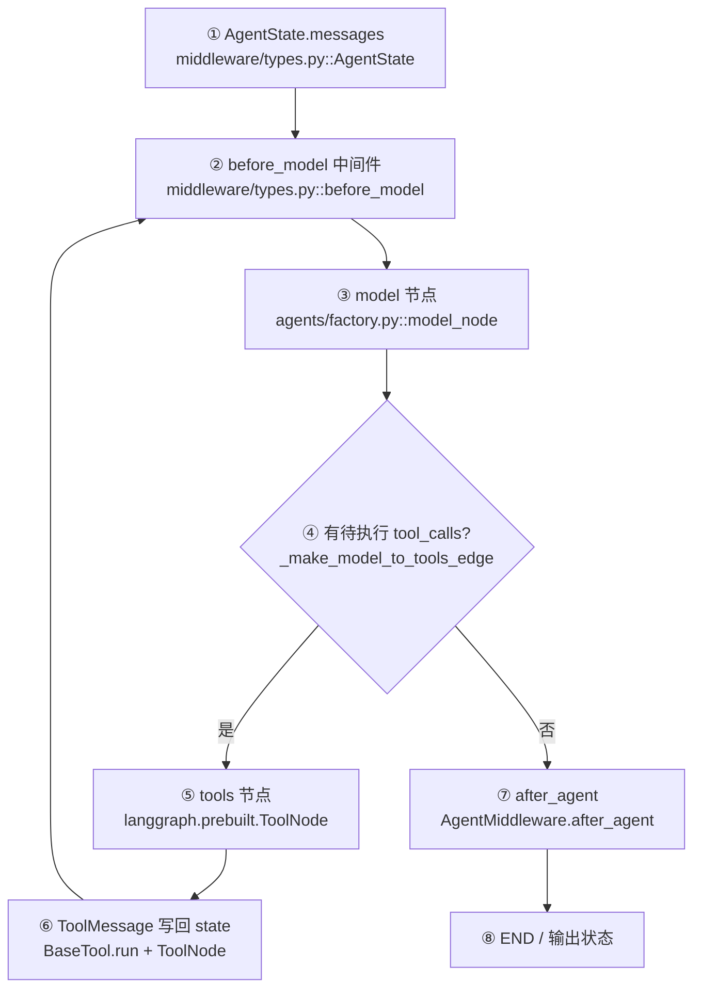
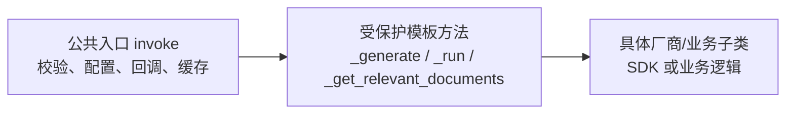

# 02. 整体架构与模块地图

## 1. LangChain 解决的核心问题

直接调用模型 SDK 很简单，但真实应用还需要 Prompt、结构化数据、工具、检索、重试、并发、流式、观测和状态。LangChain 的核心不是“包一层模型 API”，而是把这些异构组件统一成可组合、可观测的执行单元。

可以把架构分成四层：



| 节点 | 责任 | 主要源码 |
|---|---|---|
| 应用/编排 | 构建 Agent 状态图，控制模型—工具循环 | [`agents/factory.py::create_agent`](../libs/langchain_v1/langchain/agents/factory.py) |
| 组合协议 | 统一 `invoke/ainvoke/batch/stream`，提供顺序/并行组合 | [`runnables/base.py::Runnable`](../libs/core/langchain_core/runnables/base.py) |
| 领域抽象 | 定义模型、工具、检索器等模板方法 | [`language_models`](../libs/core/langchain_core/language_models)、[`tools`](../libs/core/langchain_core/tools)、[`retrievers.py`](../libs/core/langchain_core/retrievers.py) |
| 厂商实现 | 参数转换、SDK 请求、响应适配 | [`langchain_openai/chat_models/base.py`](../libs/partners/openai/langchain_openai/chat_models/base.py) |

## 2. 包依赖方向



依赖定义：

- [`langchain_v1/pyproject.toml`](../libs/langchain_v1/pyproject.toml)：依赖 `langchain-core`、`langgraph`、Pydantic。
- [`partners/openai/pyproject.toml`](../libs/partners/openai/pyproject.toml)：依赖 `langchain-core`、OpenAI SDK、tiktoken。
- core 不反向依赖具体厂商，这让 `BaseChatModel` 可以被任何厂商实现。

这就是“依赖倒置”：高层逻辑依赖抽象，不依赖 OpenAI 的具体类型。

## 3. 核心模块总表

### 3.1 `langchain-core`

| 模块 | 输入 → 输出 | 核心思想 | 第一入口 |
|---|---|---|---|
| `runnables` | 任意 `Input → Output` | 统一执行协议、组合、配置传播 | [`Runnable`](../libs/core/langchain_core/runnables/base.py) |
| `prompts` | `dict → PromptValue` | 校验变量并生成模型无关的 Prompt 值 | [`BasePromptTemplate`](../libs/core/langchain_core/prompts/base.py) |
| `prompt_values` | Prompt 值 → str/messages | 延迟决定文本模型或聊天模型表示 | [`PromptValue`](../libs/core/langchain_core/prompt_values.py) |
| `messages` | 角色化消息 | 标准化 Human/AI/System/Tool 及消息块 | [`BaseMessage`](../libs/core/langchain_core/messages/base.py) |
| `language_models` | str/messages → AIMessage/str | 定义模型模板方法，处理缓存、限流、回调、流式 | [`BaseChatModel`](../libs/core/langchain_core/language_models/chat_models.py) |
| `outputs` | 厂商响应 → Generation/Result | 保存候选生成、消息、元数据 | [`ChatResult`](../libs/core/langchain_core/outputs/chat_result.py) |
| `output_parsers` | Message/Generation → 业务对象 | 将模型输出变成 str、JSON、Pydantic 等 | [`BaseOutputParser`](../libs/core/langchain_core/output_parsers/base.py) |
| `tools` | str/dict/ToolCall → Tool 输出 | 从函数 schema 化并统一执行、校验、错误处理 | [`BaseTool`](../libs/core/langchain_core/tools/base.py) |
| `documents` | 文本 + metadata | RAG 中可传递、可序列化的基本记录 | [`Document`](../libs/core/langchain_core/documents/base.py) |
| `document_loaders` | 外部数据 → Document 迭代器 | 只定义 loader 抽象，具体 loader 多在其他包 | [`BaseLoader`](../libs/core/langchain_core/document_loaders/base.py) |
| `embeddings` | 文本 → 浮点向量 | 区分文档批量向量与查询向量 | [`Embeddings`](../libs/core/langchain_core/embeddings/embeddings.py) |
| `vectorstores` | Document/向量 ↔ 相似文档 | 统一存储、相似度、MMR 和 retriever 转换 | [`VectorStore`](../libs/core/langchain_core/vectorstores/base.py) |
| `retrievers.py` | 查询 str → `list[Document]` | 把任何检索方式统一成 Runnable | [`BaseRetriever`](../libs/core/langchain_core/retrievers.py) |
| `callbacks` | 生命周期事件 | 建立父子 run，广播 start/token/end/error | [`CallbackManager`](../libs/core/langchain_core/callbacks/manager.py) |
| `tracers` | callback 事件 → trace/log | 将运行树输出到控制台、内存或 LangSmith | [`tracers`](../libs/core/langchain_core/tracers) |
| `load` | 对象 ↔ 可序列化结构 | 受控序列化/反序列化与 secret 占位 | [`Serializable`](../libs/core/langchain_core/load/serializable.py) |
| `caches` | Prompt+模型参数 ↔ Generation | 在真正模型请求前短路 | [`caches.py`](../libs/core/langchain_core/caches.py) |
| `rate_limiters` | 调用许可 | 缓存未命中后、API 请求前限流 | [`rate_limiters.py`](../libs/core/langchain_core/rate_limiters.py) |
| `stores` | key-value/batch 存储 | 为内存、文档和应用状态提供最小存储协议 | [`stores.py`](../libs/core/langchain_core/stores.py) |
| `indexing` | 文档变更 → 写入/删除 | 记录 source/hash，避免重复索引 | [`indexing/api.py`](../libs/core/langchain_core/indexing/api.py) |

### 3.2 新版 `langchain`

| 模块 | 责任 | 主要入口 |
|---|---|---|
| `agents` | 构造有状态 Agent 图和循环边 | [`create_agent`](../libs/langchain_v1/langchain/agents/factory.py) |
| `agents.middleware` | 在 agent/model/tool 前后注入逻辑 | [`AgentMiddleware`](../libs/langchain_v1/langchain/agents/middleware/types.py) |
| `agents.structured_output` | Provider/Tool/Auto 三种结构化输出策略 | [`structured_output.py`](../libs/langchain_v1/langchain/agents/structured_output.py) |
| `chat_models` | 按字符串解析 provider 并延迟导入厂商包 | [`init_chat_model`](../libs/langchain_v1/langchain/chat_models/base.py) |
| `embeddings` | 按 provider 初始化 Embeddings | [`embeddings/base.py`](../libs/langchain_v1/langchain/embeddings/base.py) |
| `tools` | 兼容导出 LangGraph ToolNode 相关类型 | [`tools/tool_node.py`](../libs/langchain_v1/langchain/tools/tool_node.py) |
| `messages` | 从 core 重新导出消息公共 API | [`messages/__init__.py`](../libs/langchain_v1/langchain/messages/__init__.py) |

注意：Agent 的图执行器和 `ToolNode` 主实现来自依赖 `langgraph`，本仓库 [`langchain/tools/tool_node.py`](../libs/langchain_v1/langchain/tools/tool_node.py) 主要是兼容导出；LangChain 在 [`agents/factory.py`](../libs/langchain_v1/langchain/agents/factory.py) 负责把模型、中间件、工具节点和条件边组装起来。

## 4. 两条最重要的数据流

### 4.1 普通 LCEL Chain



`prompt | model | parser` 不是语法糖拼字符串，而是创建 [`RunnableSequence`](../libs/core/langchain_core/runnables/base.py)。其 `invoke` 逐步把上一步输出作为下一步输入。

### 4.2 Agent 循环



Agent 的停止条件不是固定次数，而主要是：模型没有 `tool_calls`、已经得到结构化响应、工具设置 `return_direct=True`，或中间件显式跳到 `end`。具体条件见 [`_make_model_to_tools_edge`](../libs/langchain_v1/langchain/agents/factory.py) 和 [`_make_tools_to_model_edge`](../libs/langchain_v1/langchain/agents/factory.py)。

## 5. 继承与模板方法

理解源码时要区分“公共入口”和“子类实现点”：



| 抽象 | 用户通常调用 | 子类主要实现 |
|---|---|---|
| `BaseChatModel` | `invoke/stream` | `_generate/_stream` |
| `BaseTool` | `invoke/run` | `_run` |
| `BaseRetriever` | `invoke` | `_get_relevant_documents` |
| `BaseOutputParser` | `invoke` | `parse` / `parse_result` |
| `Embeddings` | `embed_documents/embed_query` | 同名方法（抽象接口） |

公共入口集中处理横切能力，具体子类只处理差异。这是阅读源码时最有效的“切面”：先看公共入口，再跳到一个具体实现。

## 6. 为什么大量使用 Pydantic 和 TypedDict

- Pydantic 模型用于运行时需要校验、schema、序列化的对象，例如 Tool 参数模型、RunnableSerializable。
- `TypedDict` 用于运行时仍是普通 dict、但希望类型检查器知道字段的状态，例如 [`AgentState`](../libs/langchain_v1/langchain/agents/middleware/types.py) 和 [`RunnableConfig`](../libs/core/langchain_core/runnables/config.py)。
- Protocol/ABC 用于描述行为接口，避免绑定具体类。

新手看到复杂类型签名时，可以先擦除类型参数阅读：

```python
# 源码思维
class Runnable(Generic[Input, Output]): ...

# 第一遍阅读时可暂时理解为
class Runnable:
    def invoke(self, input, config=None): ...
```

## 7. 不要混淆的三组概念

| 概念 A | 概念 B | 区别 |
|---|---|---|
| `Message` | `Generation/Result` | Message 是对话数据；Result 还包含候选、token/模型元数据 |
| `Tool` | `Retriever` | Tool 是模型可选择调用的动作；Retriever 是 query→documents，可包装成 Tool |
| `RunnableSequence` | Agent Graph | Sequence 是静态顺序；Agent Graph 有状态、条件边和循环 |

