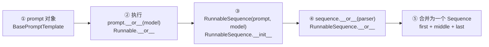
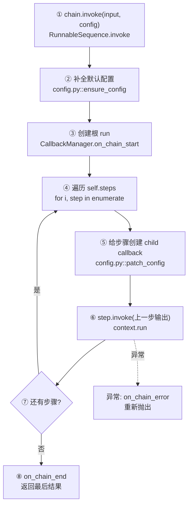
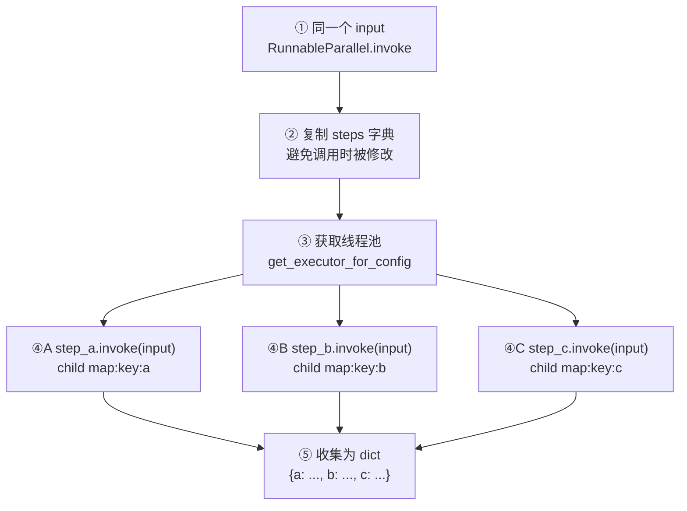
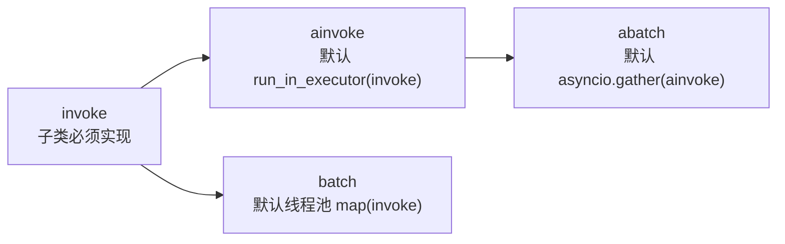
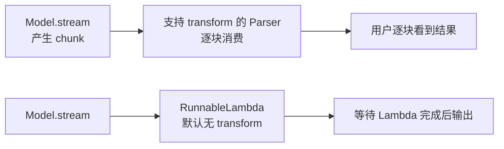
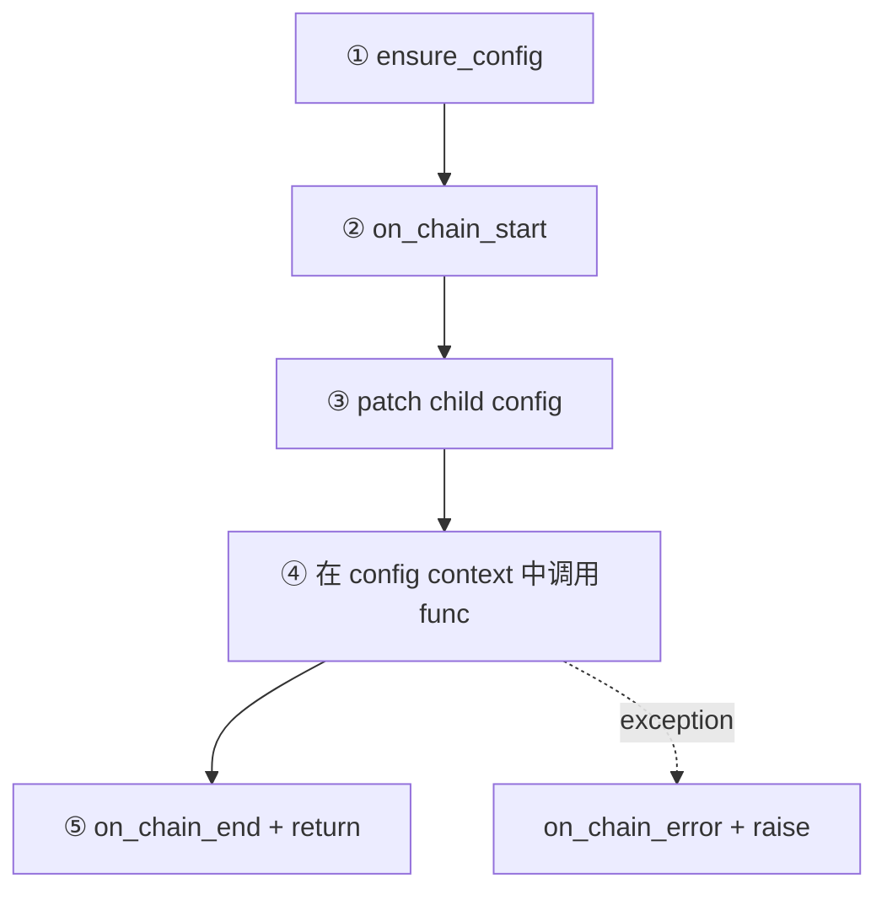

# 03. Runnable 与 LCEL

## 1. Runnable 是什么

[`Runnable`](../libs/core/langchain_core/runnables/base.py) 表示一个“输入变输出”的工作单元。它统一提供：

- 单次：`invoke` / `ainvoke`
- 批量：`batch` / `abatch`
- 流式：`stream` / `astream`
- 组合：`|`、`pipe`、并行 dict
- 横切配置：callbacks、tags、metadata、`max_concurrency`

Prompt、Model、Parser、Tool、Retriever 都继承或实现 Runnable，所以不同领域对象能用同一套执行方式。

## 2. `prompt | model | parser` 是如何构建的



| 节点 | 实现 |
|---|---|
| ① 可组合对象 | [`Runnable`](../libs/core/langchain_core/runnables/base.py) |
| ② 运算符重载 | [`Runnable.__or__`](../libs/core/langchain_core/runnables/base.py) |
| ③ 顺序容器 | [`RunnableSequence`](../libs/core/langchain_core/runnables/base.py) |
| ④ 序列继续拼接 | [`RunnableSequence.__or__`](../libs/core/langchain_core/runnables/base.py) |
| ⑤ callable/dict 自动转换 | [`coerce_to_runnable`](../libs/core/langchain_core/runnables/base.py) |

`coerce_to_runnable` 的意义很关键：普通函数会变成 `RunnableLambda`，dict 会变成 `RunnableParallel`，因此下面写法成立：

```python
chain = prompt | model | {"text": StrOutputParser(), "raw": lambda x: x}
```

## 3. `RunnableSequence.invoke` 核心流程



源码节点：

1. [`RunnableSequence.invoke`](../libs/core/langchain_core/runnables/base.py)：顺序执行主循环。
2. [`ensure_config`](../libs/core/langchain_core/runnables/config.py)：为 callbacks/tags/metadata/recursion 等字段补默认值。
3. [`get_callback_manager_for_config`](../libs/core/langchain_core/runnables/config.py)：从 config 构造回调管理器。
4. [`patch_config`](../libs/core/langchain_core/runnables/config.py)：将当前步骤绑定为父 run 的 child。
5. [`set_config_context`](../libs/core/langchain_core/runnables/config.py)：通过 contextvars 让嵌套调用继承配置。

核心伪代码只有几行：

```python
value = input
for step in self.steps:
    value = step.invoke(value, child_config)
return value
```

真实源码的其余复杂度主要来自可观测性、异常事件和上下文传播。

## 4. 并行组合 `RunnableParallel`



主实现见 [`RunnableParallel.invoke`](../libs/core/langchain_core/runnables/base.py)。默认使用由 [`get_executor_for_config`](../libs/core/langchain_core/runnables/config.py) 创建的线程池；`max_concurrency` 可限制并发。

顺序与并行的差别：

| 类型 | 下一组件的输入 | 输出 |
|---|---|---|
| `RunnableSequence` | 上一组件的输出 | 最后组件输出 |
| `RunnableParallel` | 每个分支都拿到同一个输入 | 以分支名为 key 的 dict |

## 5. 同步、异步和批处理



默认策略在 [`Runnable`](../libs/core/langchain_core/runnables/base.py)：

- `ainvoke` 默认把同步 `invoke` 放入 executor，具体组件可以覆盖为原生 async。
- `batch` 默认线程池并行多个 `invoke`，支持真正批 API 的子类可以覆盖。
- 这种默认实现让每个新组件只实现 `invoke` 也能获得完整基本能力。

## 6. 流式为什么有时“被卡住”

`RunnableSequence` 通过 `transform/atransform` 把上游迭代器传给下游。如果所有组件都支持 transform，chunk 可以一路流动；中间某个组件不支持时，必须等该组件计算完成后才继续流。



实现入口：

- [`RunnableSequence._transform/transform/stream`](../libs/core/langchain_core/runnables/base.py)
- [`BaseTransformOutputParser`](../libs/core/langchain_core/output_parsers/transform.py)
- [`RunnableLambda`](../libs/core/langchain_core/runnables/base.py)

排查流式延迟时，不要只看模型，要逐个检查 sequence 中是否存在不支持 transform 的步骤。

## 7. `_call_with_config`：公共横切逻辑

自定义 Runnable 子类常通过 [`Runnable._call_with_config`](../libs/core/langchain_core/runnables/base.py) 实现 `invoke`：



这解释了为什么 Prompt、Parser 等看似简单的格式化函数，仍能自动出现在 trace 树中。

## 8. Config 不属于业务输入

[`RunnableConfig`](../libs/core/langchain_core/runnables/config.py) 是 `TypedDict`，典型字段：

```python
config = {
    "tags": ["lesson-03"],
    "metadata": {"student": "beginner"},
    "run_name": "explain-runnable",
    "max_concurrency": 4,
    "callbacks": [...],
    "configurable": {...},
}
```

业务 dict 会流经 Prompt/Model；config 则沿运行树传播、控制执行和观测。不要把 API key 等 secret 塞进 metadata，因为 metadata 可能被 tracer 记录。

## 9. 阅读练习

```python
from langchain_core.runnables import RunnableLambda, RunnableParallel

add_one = RunnableLambda(lambda x: x + 1)
branches = RunnableParallel(double=lambda x: x * 2, square=lambda x: x**2)
chain = add_one | branches

print(chain.invoke(2))  # {'double': 6, 'square': 9}
print(chain.get_graph().draw_mermaid())
```

断点建议：

1. `Runnable.__or__`：观察右侧 dict 如何被转换。
2. `RunnableSequence.invoke`：观察 `self.steps`。
3. `RunnableParallel.invoke`：观察相同 `input` 如何提交给多个 future。
4. `patch_config`：观察 child callbacks 如何产生。

