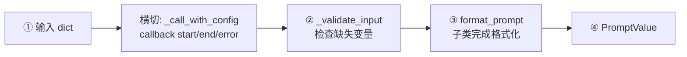
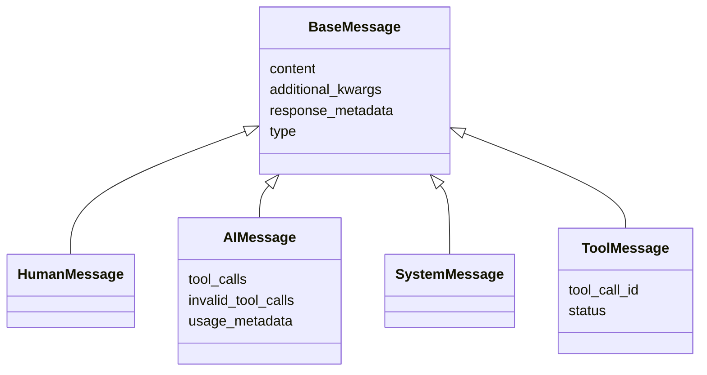
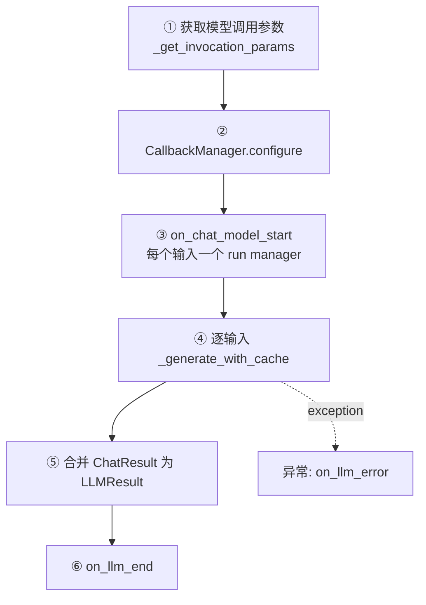
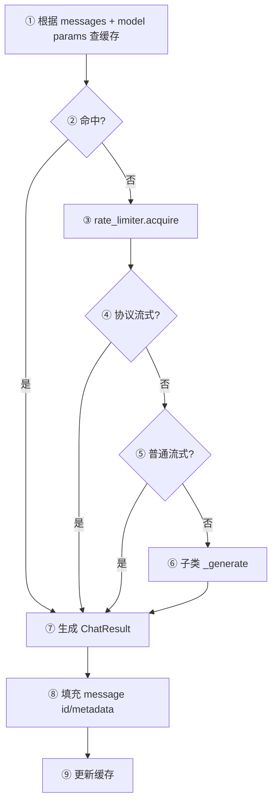
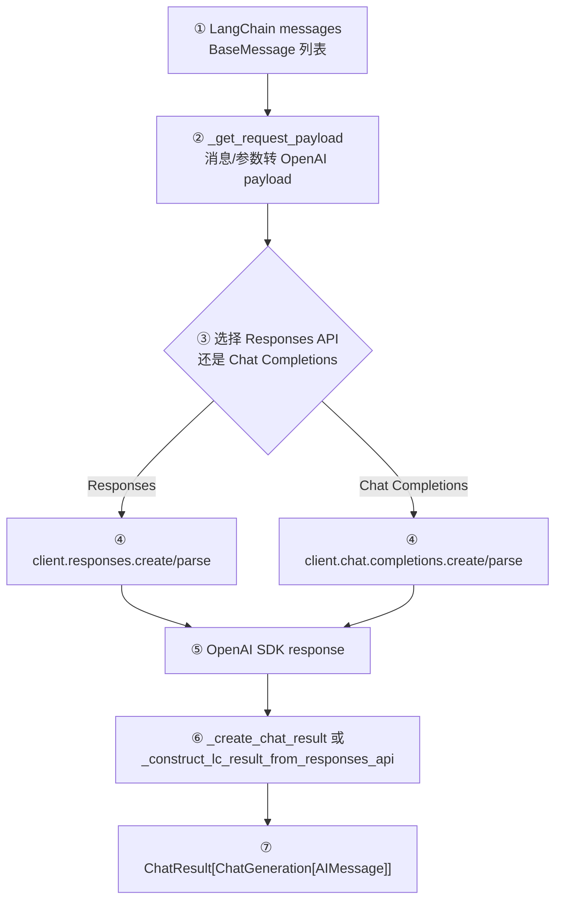
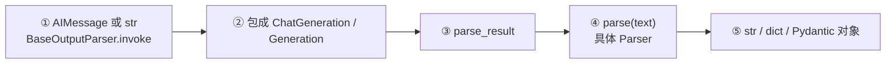
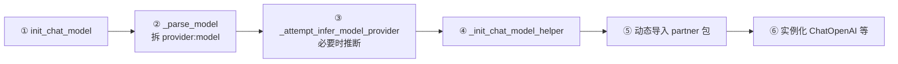

# 04. Prompt、Message、Model 与 OutputParser

本章跟踪这条最常见的 Chain：

```python
chain = prompt | model | parser
result = chain.invoke({"topic": "Runnable"})
```

## 1. 完整调用流程

```mermaid
flowchart TD
    IN["① dict 输入<br/>RunnableSequence.invoke"]
    PV["② 校验并 format_prompt<br/>BasePromptTemplate.invoke"]
    MSGS["③ PromptValue.to_messages<br/>ChatPromptValue"]
    INV["④ 标准化模型输入<br/>BaseChatModel.invoke"]
    GEN["⑤ 建立 callback run<br/>BaseChatModel.generate"]
    CACHE{"⑥ 缓存命中?<br/>_generate_with_cache"]
    SDK["⑦ 组装 payload 并调用 SDK<br/>BaseChatOpenAI._generate"]
    RES["⑧ 转成 ChatResult/AIMessage<br/>_create_chat_result"]
    PARSE["⑨ parse_result / parse<br/>BaseOutputParser.invoke"]
    OUT["⑩ Python 业务对象"]

    IN --> PV --> MSGS --> INV --> GEN --> CACHE
    CACHE -- 命中 --> RES
    CACHE -- 未命中 --> SDK --> RES
    RES --> PARSE --> OUT
```

## 2. Prompt 模块

### 2.1 为什么返回 `PromptValue`，而不是字符串

同一份 Prompt 可能交给文本模型或聊天模型。[`PromptValue`](../libs/core/langchain_core/prompt_values.py) 定义两个视图：

- `to_string()`：文本模型视图；
- `to_messages()`：聊天模型视图。

因此模板层不需要提前绑定具体模型类型。

### 2.2 `BasePromptTemplate.invoke`



节点源码：

- 公共入口和校验：[`BasePromptTemplate`](../libs/core/langchain_core/prompts/base.py)
- 字符串模板：[`PromptTemplate`](../libs/core/langchain_core/prompts/prompt.py)
- 聊天模板：[`ChatPromptTemplate`](../libs/core/langchain_core/prompts/chat.py)
- f-string/Jinja2/Mustache 格式器：[`prompts/string.py`](../libs/core/langchain_core/prompts/string.py)
- 值对象：[`prompt_values.py`](../libs/core/langchain_core/prompt_values.py)

`invoke` 先 `ensure_config`，合并 prompt 自身 metadata/tags，再通过 `_call_with_config` 调用 `_format_prompt_with_error_handling`。后者先 `_validate_input`，再调用子类 `format_prompt`。

## 3. Message 模块



主要实现：

- 基类及 chunk：[`messages/base.py`](../libs/core/langchain_core/messages/base.py)
- 人类消息：[`messages/human.py`](../libs/core/langchain_core/messages/human.py)
- AI 消息和 tool call 规范化：[`messages/ai.py`](../libs/core/langchain_core/messages/ai.py)
- 工具结果消息：[`messages/tool.py`](../libs/core/langchain_core/messages/tool.py)
- 输入 tuple/dict 转消息：[`convert_to_messages`](../libs/core/langchain_core/messages/utils.py)

流式输出使用 `AIMessageChunk`。chunk 支持相加合并，最后可通过 [`message_chunk_to_message`](../libs/core/langchain_core/messages/utils.py) 转成完整消息。

## 4. BaseChatModel 公共流程

### 4.1 `invoke` 只负责适配单输入/单输出

[`BaseChatModel.invoke`](../libs/core/langchain_core/language_models/chat_models.py) 做三件事：

1. `_convert_input` 把 str、`PromptValue` 或 message sequence 统一成 `PromptValue`；
2. 调 `generate_prompt`，最终进入批量语义的 `generate`；
3. 从 `LLMResult.generations[0][0]` 取出 `AIMessage`。

这说明 `invoke` 的简洁返回并不是底层 SDK 直接返回值，而是从通用 Result 包装中抽取。

### 4.2 `generate` 负责运行生命周期



实现：[`BaseChatModel.generate`](../libs/core/langchain_core/language_models/chat_models.py)。

### 4.3 `_generate_with_cache` 是关键分叉点



实现：[`BaseChatModel._generate_with_cache`](../libs/core/langchain_core/language_models/chat_models.py)。它体现了模板方法模式：缓存、限流、流式、元数据等公共能力留在 core，厂商只实现 `_generate`。

## 5. OpenAI 适配层如何落地

具体类 [`ChatOpenAI`](../libs/partners/openai/langchain_openai/chat_models/base.py) 继承 `BaseChatOpenAI`，而 `BaseChatOpenAI` 实现 core 的模板方法。



源码节点：

| 节点 | 代码 |
|---|---|
| 请求入口 | [`BaseChatOpenAI._generate`](../libs/partners/openai/langchain_openai/chat_models/base.py) |
| payload 组装 | [`BaseChatOpenAI._get_request_payload`](../libs/partners/openai/langchain_openai/chat_models/base.py) |
| 消息转 OpenAI dict | [`_convert_message_to_dict`](../libs/partners/openai/langchain_openai/chat_models/base.py) |
| OpenAI dict 转 Message | [`_convert_dict_to_message`](../libs/partners/openai/langchain_openai/chat_models/base.py) |
| Chat Completions 响应适配 | [`BaseChatOpenAI._create_chat_result`](../libs/partners/openai/langchain_openai/chat_models/base.py) |
| 同步/异步流 | [`BaseChatOpenAI._stream/_astream`](../libs/partners/openai/langchain_openai/chat_models/base.py) |
| 工具绑定 | [`BaseChatOpenAI.bind_tools`](../libs/partners/openai/langchain_openai/chat_models/base.py) |
| 结构化输出 | [`BaseChatOpenAI.with_structured_output`](../libs/partners/openai/langchain_openai/chat_models/base.py) |

这层的本质是双向 Adapter：LangChain 标准消息 → OpenAI payload；OpenAI response/chunk → LangChain 标准输出。

## 6. OutputParser 模块



节点源码：

- 抽象和 Runnable 入口：[`output_parsers/base.py`](../libs/core/langchain_core/output_parsers/base.py)
- 字符串：[`StrOutputParser`](../libs/core/langchain_core/output_parsers/string.py)
- JSON：[`JsonOutputParser`](../libs/core/langchain_core/output_parsers/json.py)
- Pydantic：[`PydanticOutputParser`](../libs/core/langchain_core/output_parsers/pydantic.py)
- OpenAI tool calls：[`output_parsers/openai_tools.py`](../libs/core/langchain_core/output_parsers/openai_tools.py)
- 支持逐 chunk 的 parser：[`output_parsers/transform.py`](../libs/core/langchain_core/output_parsers/transform.py)

`StrOutputParser.parse` 看起来只返回原字符串，但它仍有价值：它把 `AIMessage/Generation` 适配成稳定的 `str` Runnable，并继承 batch/stream/callback 能力。

## 7. 模型字符串如何初始化具体厂商

调用：

```python
model = init_chat_model("openai:some-model")
```

流程：



全部入口位于 [`langchain/chat_models/base.py`](../libs/langchain_v1/langchain/chat_models/base.py)。动态导入使 `langchain` 不必硬依赖所有厂商包；只有实际选择 provider 时才要求对应集成已安装。

## 8. 建议断点

按以下顺序单步：

1. [`RunnableSequence.invoke`](../libs/core/langchain_core/runnables/base.py)：看步骤间对象类型如何变化。
2. [`BasePromptTemplate.invoke`](../libs/core/langchain_core/prompts/base.py)：看输入变量校验。
3. [`BaseChatModel._convert_input`](../libs/core/langchain_core/language_models/chat_models.py)：看 PromptValue 转换。
4. [`BaseChatModel.generate`](../libs/core/langchain_core/language_models/chat_models.py)：看 callback run managers。
5. [`BaseChatModel._generate_with_cache`](../libs/core/langchain_core/language_models/chat_models.py)：看分支。
6. Fake 模型的 `_generate`，之后再换成 OpenAI 的 `_generate`。
7. [`BaseOutputParser.invoke`](../libs/core/langchain_core/output_parsers/base.py)：看 Message 如何包装成 Generation。

