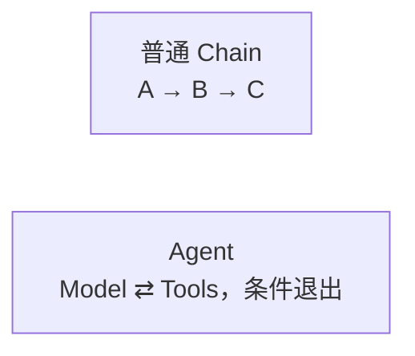
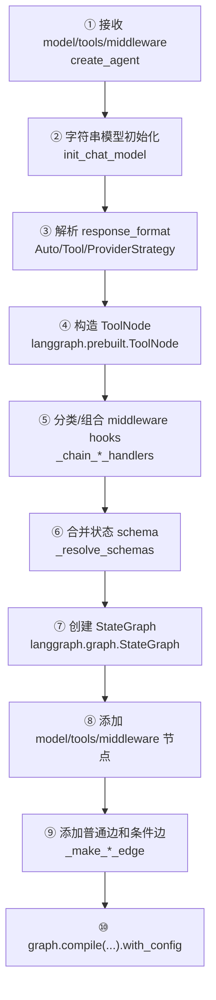
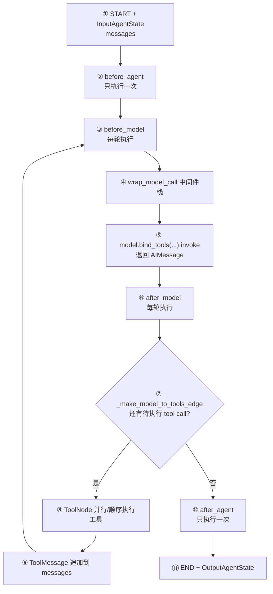
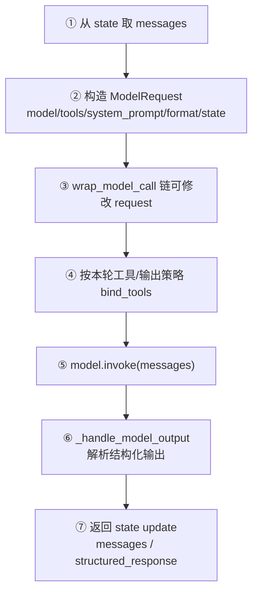
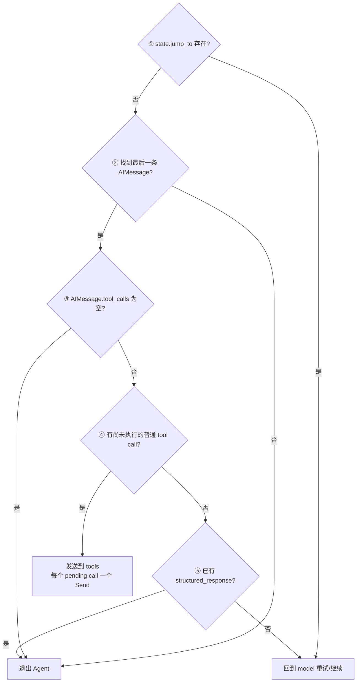
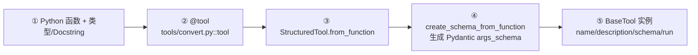
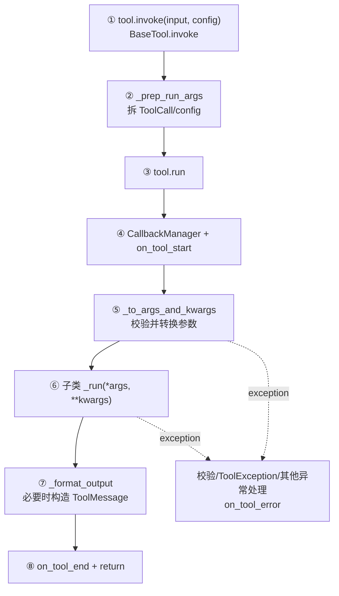
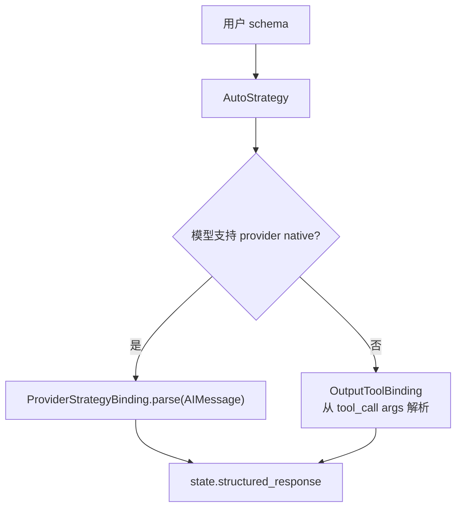

# 05. Agent、Tool 与 Middleware

## 1. Agent 的本质

普通 Chain 的路径在运行前已经确定；Agent 每轮由模型输出决定下一步：直接回答，还是调用一个或多个工具。因此新版 `create_agent` 返回的是编译后的 `StateGraph`，不是 `RunnableSequence`。



入口：[`langchain.agents.factory.create_agent`](../libs/langchain_v1/langchain/agents/factory.py)。

## 2. 先区分构图阶段与运行阶段

### 2.1 构图阶段：调用一次 `create_agent`



节点源码：

| 节点 | 实现 |
|---|---|
| ①～④ 参数处理、工具分类 | [`create_agent`](../libs/langchain_v1/langchain/agents/factory.py) |
| ② provider 模型构造 | [`init_chat_model`](../libs/langchain_v1/langchain/chat_models/base.py) |
| ③ 输出策略对象 | [`agents/structured_output.py`](../libs/langchain_v1/langchain/agents/structured_output.py) |
| ④ ToolNode | 本仓库从 `langgraph.prebuilt` 导入；兼容导出见 [`tools/tool_node.py`](../libs/langchain_v1/langchain/tools/tool_node.py) |
| ⑤ middleware 协议/组合器 | [`middleware/types.py::AgentMiddleware`](../libs/langchain_v1/langchain/agents/middleware/types.py)、[`agents/factory.py`](../libs/langchain_v1/langchain/agents/factory.py) |
| ⑥ 状态合并 | [`_resolve_schemas`](../libs/langchain_v1/langchain/agents/factory.py) |
| ⑧～⑩ 节点、边、编译 | [`create_agent`](../libs/langchain_v1/langchain/agents/factory.py) |

`create_agent` 做的是“生成执行程序”。真正的模型调用发生在之后的 `agent.invoke/stream`。

### 2.2 运行阶段：每次 `agent.invoke`



`before_agent/after_agent` 包住完整运行；`before_model/after_model` 位于循环内部。middleware 注册顺序和“洋葱式 wrapper”共同决定调用顺序，相关组合函数见 [`_chain_model_call_handlers`](../libs/langchain_v1/langchain/agents/factory.py) 与 [`_chain_tool_call_wrappers`](../libs/langchain_v1/langchain/agents/factory.py)。

## 3. AgentState 如何保存运行状态

核心状态定义在 [`middleware/types.py::AgentState`](../libs/langchain_v1/langchain/agents/middleware/types.py)：

- `messages`：对话历史，节点通过 reducer 追加/更新消息；
- `jump_to`：middleware 可要求跳到 `model/tools/end`；
- `structured_response`：结构化输出成功后写入；
- middleware 可通过自己的 `state_schema` 增加字段。

输入和输出使用更窄的 [`InputAgentState`](../libs/langchain_v1/langchain/agents/middleware/types.py) / [`OutputAgentState`](../libs/langchain_v1/langchain/agents/middleware/types.py)，避免所有内部字段都暴露给调用者。

## 4. model 节点做什么

model 节点定义在 `create_agent` 内部，阅读时搜索 `_execute_model_sync`、`model_node` 或 `_execute_model_async`。主线是：



节点实现：

- 请求/响应值对象：[`ModelRequest`、`ModelResponse`](../libs/langchain_v1/langchain/agents/middleware/types.py)
- 模型执行和 output handling：[`agents/factory.py::create_agent` 内部函数](../libs/langchain_v1/langchain/agents/factory.py)
- core 模型调用：[`BaseChatModel.invoke`](../libs/core/langchain_core/language_models/chat_models.py)
- OpenAI 工具绑定：[`BaseChatOpenAI.bind_tools`](../libs/partners/openai/langchain_openai/chat_models/base.py)

## 5. 条件边与退出条件

### 5.1 model → tools / end

[`_make_model_to_tools_edge`](../libs/langchain_v1/langchain/agents/factory.py) 按以下优先级路由：



### 5.2 tools → model / end

[`_make_tools_to_model_edge`](../libs/langchain_v1/langchain/agents/factory.py) 的主要退出条件：

- 本轮执行的客户端工具全部 `return_direct=True`；
- 执行的是结构化输出工具；
- 否则回 model，让模型读取 ToolMessage 后继续推理。

这段条件边是理解 ReAct 风格循环最值得精读的代码。

## 6. 函数如何变成 Tool

```python
from langchain_core.tools import tool

@tool
def add(a: int, b: int) -> int:
    """Return the sum of two integers."""
    return a + b
```

构造流程：



源码节点：

- decorator 与 Runnable 转 Tool：[`tools/convert.py`](../libs/core/langchain_core/tools/convert.py)
- 函数工具：[`StructuredTool`](../libs/core/langchain_core/tools/structured.py)
- schema 推断：[`create_schema_from_function`](../libs/core/langchain_core/tools/base.py)
- Tool 基类：[`BaseTool`](../libs/core/langchain_core/tools/base.py)

类型标注不是装饰：它会进入工具 JSON Schema，让模型知道参数结构，并在执行前由 Pydantic 校验。

## 7. `BaseTool.invoke/run` 执行流程



节点均在 [`tools/base.py`](../libs/core/langchain_core/tools/base.py)：`BaseTool.invoke`、`run`、`_parse_input`、`_to_args_and_kwargs`、`_prep_run_args`、`_format_output`。函数型工具的 `_run` 由 [`StructuredTool`](../libs/core/langchain_core/tools/structured.py) 实现并调用原函数。

如果输入是完整 `ToolCall`（含 id），输出会关联该 `tool_call_id`，Agent 才能知道哪条 ToolMessage 对应哪次模型请求。

## 8. Middleware 扩展点

[`AgentMiddleware`](../libs/langchain_v1/langchain/agents/middleware/types.py) 的主要 hook：

| Hook | 频率 | 用途 |
|---|---|---|
| `before_agent/after_agent` | 每次 Agent 调用一次 | 初始化/最终清理、全局状态 |
| `before_model/after_model` | 每轮模型调用一次 | 摘要、上下文编辑、响应检查 |
| `wrap_model_call/awrap_model_call` | 包裹模型调用 | 重试、fallback、动态模型/Prompt |
| `wrap_tool_call/awrap_tool_call` | 包裹工具调用 | 重试、错误转消息、权限控制 |
| `tools` 属性 | 构图时收集 | middleware 自带工具 |
| `state_schema/context_schema` | 构图时合并 | 增加状态和上下文字段 |

仓库中的具体实现是最好的例子：

- 模型重试：[`model_retry.py`](../libs/langchain_v1/langchain/agents/middleware/model_retry.py)
- 模型 fallback：[`model_fallback.py`](../libs/langchain_v1/langchain/agents/middleware/model_fallback.py)
- 工具错误：[`tool_error.py`](../libs/langchain_v1/langchain/agents/middleware/tool_error.py)
- 工具重试：[`tool_retry.py`](../libs/langchain_v1/langchain/agents/middleware/tool_retry.py)
- 上下文摘要：[`summarization.py`](../libs/langchain_v1/langchain/agents/middleware/summarization.py)
- 人工审批：[`human_in_the_loop.py`](../libs/langchain_v1/langchain/agents/middleware/human_in_the_loop.py)
- PII 处理：[`pii.py`](../libs/langchain_v1/langchain/agents/middleware/pii.py)
- 模型/工具调用次数限制：[`model_call_limit.py`](../libs/langchain_v1/langchain/agents/middleware/model_call_limit.py)、[`tool_call_limit.py`](../libs/langchain_v1/langchain/agents/middleware/tool_call_limit.py)

## 9. 结构化输出

[`agents/structured_output.py`](../libs/langchain_v1/langchain/agents/structured_output.py) 定义三种意图：

- `ProviderStrategy`：用厂商原生结构化输出能力；
- `ToolStrategy`：把目标 schema 表示成特殊工具调用；
- `AutoStrategy`：构图时保留自动选择意图，运行时按模型能力决定。



策略解析、错误重试和 state update 位于 [`create_agent` 内的 `_handle_model_output`](../libs/langchain_v1/langchain/agents/factory.py)。

## 10. 建议断点

1. `create_agent` 开头：区分构图参数。
2. `ToolNode(...)` 附近：看普通函数如何变成 `BaseTool`。
3. `model_node` / `_execute_model_sync`：看每轮 `ModelRequest`。
4. `_make_model_to_tools_edge` 返回的内部函数：看退出判断。
5. `BaseTool.run`：看 args schema 校验。
6. `_make_tools_to_model_edge`：看 `return_direct`。

执行时观察 `state["messages"]` 的类型序列，典型变化是：

```text
HumanMessage
→ AIMessage(tool_calls=[...])
→ ToolMessage(tool_call_id=...)
→ AIMessage(final answer)
```

