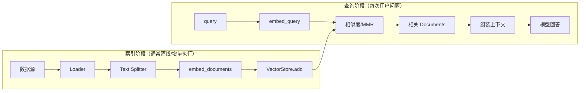
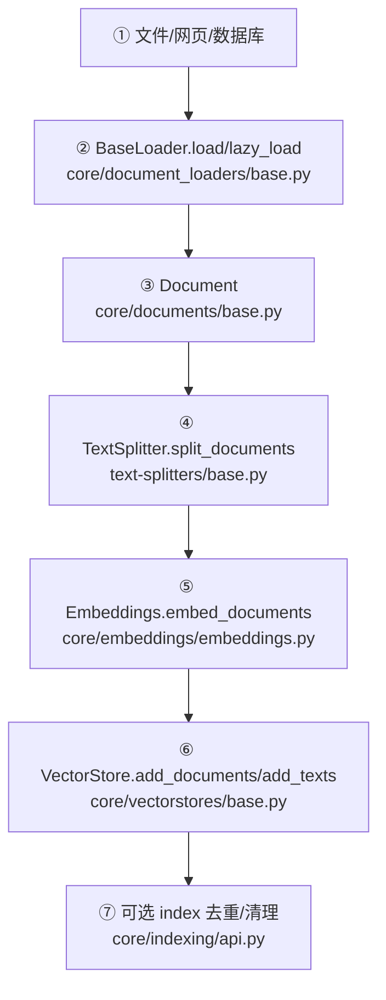
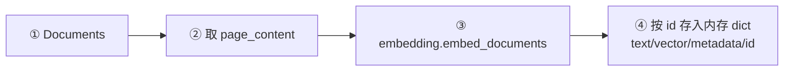
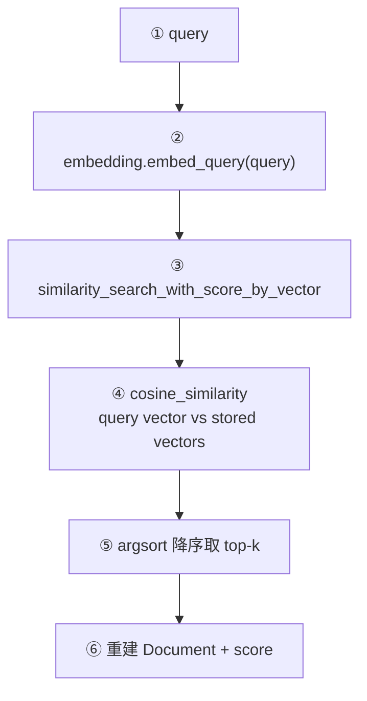
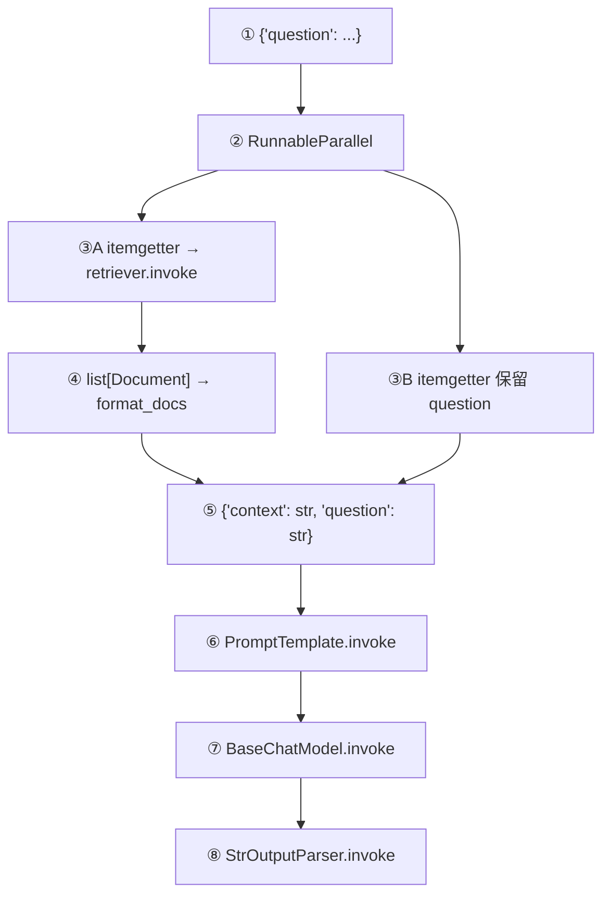
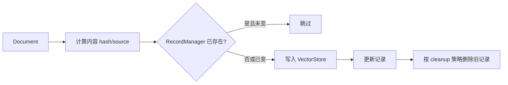

# 06. Document、Embedding、VectorStore、Retriever 与 RAG

## 1. RAG 有两个阶段

理解源码时必须把“索引”与“查询”分开：



LangChain 把各节点做成接口，用户可替换 loader、embedding、vector database 和模型。

## 2. 索引阶段源码流程



节点实现：

| 节点 | 核心代码 | 阅读要点 |
|---|---|---|
| Loader 协议 | [`BaseLoader`](../libs/core/langchain_core/document_loaders/base.py) | `load` 通常收集 `lazy_load`；具体数据源 loader 多在集成包 |
| 文档数据 | [`Document`](../libs/core/langchain_core/documents/base.py) | `page_content`、`metadata`、可选 `id` |
| 文本切分 | [`TextSplitter`](../libs/text-splitters/langchain_text_splitters/base.py) | 保留/合并 metadata，将大文档拆成 chunk |
| 向量接口 | [`Embeddings`](../libs/core/langchain_core/embeddings/embeddings.py) | 文档是批量 `embed_documents`，查询是 `embed_query` |
| 存储抽象 | [`VectorStore`](../libs/core/langchain_core/vectorstores/base.py) | `add_documents`、`delete`、搜索方法 |
| 增量索引 | [`index`](../libs/core/langchain_core/indexing/api.py) | 通过记录管理器避免重复写入并清理旧内容 |

`Document` 的 metadata 是来源、页码等信息的载体；切分时应保留这些字段，检索结果才可追溯。

## 3. 查询阶段源码流程

```mermaid
flowchart TD
    Q["① query: str<br/>BaseRetriever.invoke"]
    CB["② on_retriever_start<br/>CallbackManager"]
    GET["③ _get_relevant_documents<br/>VectorStoreRetriever"]
    TYPE{"④ search_type"]
    SIM["⑤A similarity_search"]
    THR["⑤B similarity_score_threshold"]
    MMR["⑤C max_marginal_relevance_search"]
    DOCS["⑥ list[Document]"]
    END["⑦ on_retriever_end"]
    Q --> CB --> GET --> TYPE
    TYPE --> SIM --> DOCS
    TYPE --> THR --> DOCS
    TYPE --> MMR --> DOCS
    DOCS --> END
```

节点源码：

- Retriever 公共入口、回调和模板方法：[`BaseRetriever.invoke`](../libs/core/langchain_core/retrievers.py)
- VectorStore 转 Retriever：[`VectorStore.as_retriever`](../libs/core/langchain_core/vectorstores/base.py)
- 三种搜索路由：[`VectorStoreRetriever._get_relevant_documents`](../libs/core/langchain_core/vectorstores/base.py)
- 文档压缩接口：[`BaseDocumentCompressor`](../libs/core/langchain_core/documents/compressor.py)

Retriever 自身是 `RunnableSerializable[str, list[Document]]`，所以可以直接放进 LCEL，而 VectorStore 本身不继承 Runnable。

## 4. InMemoryVectorStore 具体实现

这是学习 VectorStore 最容易跟踪的实现：[`InMemoryVectorStore`](../libs/core/langchain_core/vectorstores/in_memory.py)。

### 4.1 写入



打开 [`vectorstores/in_memory.py`](../libs/core/langchain_core/vectorstores/in_memory.py)，搜索 `add_documents` / `add_texts`。

### 4.2 相似度查询



源码节点：

- query 向量化：[`InMemoryVectorStore.similarity_search_with_score`](../libs/core/langchain_core/vectorstores/in_memory.py)
- vector 搜索：[`similarity_search_with_score_by_vector`](../libs/core/langchain_core/vectorstores/in_memory.py)
- 内部过滤、排序和 Document 重建：[`_similarity_search_with_score_by_vector`](../libs/core/langchain_core/vectorstores/in_memory.py)
- cosine 实现/兼容：[`vectorstores/utils.py`](../libs/core/langchain_core/vectorstores/utils.py)
- MMR 算法：[`maximal_marginal_relevance`](../libs/core/langchain_core/vectorstores/utils.py)

## 5. Embeddings 为什么分两个方法

[`Embeddings`](../libs/core/langchain_core/embeddings/embeddings.py) 定义：

```python
embed_documents(texts: list[str]) -> list[list[float]]
embed_query(text: str) -> list[float]
```

文档索引通常批量执行，厂商可能提供 batch 优化；查询通常单条、低延迟。两者语义也可能允许厂商采用不同任务模式。异步方法默认可通过 executor 调用同步版本，具体厂商可覆盖。

无网络学习可使用：

- [`FakeEmbeddings`](../libs/core/langchain_core/embeddings/fake.py)
- [`DeterministicFakeEmbedding`](../libs/core/langchain_core/embeddings/fake.py)

## 6. Retriever 的模板方法

`BaseRetriever.invoke` 负责：config → callback start → `_get_relevant_documents` → callback end/error。自定义 Retriever 只需实现受保护方法：

```python
from langchain_core.documents import Document
from langchain_core.retrievers import BaseRetriever
from langchain_core.callbacks import CallbackManagerForRetrieverRun

class KeywordRetriever(BaseRetriever):
    documents: list[Document]

    def _get_relevant_documents(
        self,
        query: str,
        *,
        run_manager: CallbackManagerForRetrieverRun,
    ) -> list[Document]:
        return [doc for doc in self.documents if query in doc.page_content]
```

公共行为留在 [`BaseRetriever`](../libs/core/langchain_core/retrievers.py)，业务算法留在子类，这和 `BaseChatModel._generate`、`BaseTool._run` 是同一种模板方法模式。

## 7. Retriever 如何接入 Prompt

一个简化的 RAG Chain：

```python
from operator import itemgetter

from langchain_core.output_parsers import StrOutputParser
from langchain_core.runnables import RunnableLambda, RunnablePassthrough

def format_docs(docs):
    return "\n\n".join(doc.page_content for doc in docs)

rag_chain = (
    {
        "context": itemgetter("question") | retriever | RunnableLambda(format_docs),
        "question": itemgetter("question"),
    }
    | prompt
    | model
    | StrOutputParser()
)
```

运行图：



各节点对应：

- ② 并行分支：[`RunnableParallel`](../libs/core/langchain_core/runnables/base.py)
- ③A 检索：[`BaseRetriever.invoke`](../libs/core/langchain_core/retrievers.py)
- ④ 自定义函数适配：[`RunnableLambda`](../libs/core/langchain_core/runnables/base.py)
- ⑥ Prompt：[`BasePromptTemplate.invoke`](../libs/core/langchain_core/prompts/base.py)
- ⑦ 模型：[`BaseChatModel.invoke`](../libs/core/langchain_core/language_models/chat_models.py)
- ⑧ parser：[`BaseOutputParser.invoke`](../libs/core/langchain_core/output_parsers/base.py)

## 8. Retriever 也可以变成 Agent Tool

[`create_retriever_tool`](../libs/core/langchain_core/tools/retriever.py) 把 `BaseRetriever` 包装成 Tool：模型提供 query，工具调用 retriever，最后把 Documents 格式化为文本或“文本 + artifacts”。


这是一种 Agentic RAG：是否检索、何时检索、检索什么由模型决定；普通 RAG Chain 则每次固定检索。

## 9. Indexing 模块思路

直接重复 `add_documents` 可能产生重复向量。[`indexing/api.py`](../libs/core/langchain_core/indexing/api.py) 通过文档 hash/source id 和 [`RecordManager`](../libs/core/langchain_core/indexing/base.py) 判断：



## 10. 建议断点

1. `InMemoryVectorStore.add_documents`：看 Document 如何存成内部 dict。
2. `FakeEmbeddings.embed_documents/embed_query`：看接口调用次数和形状。
3. `BaseRetriever.invoke`：看 callback 生命周期。
4. `VectorStoreRetriever._get_relevant_documents`：切换 `search_type`。
5. `_similarity_search_with_score_by_vector`：看 filter、cosine、top-k。
6. `RunnableParallel.invoke`：看 question 保留与检索并行分支如何汇合。

