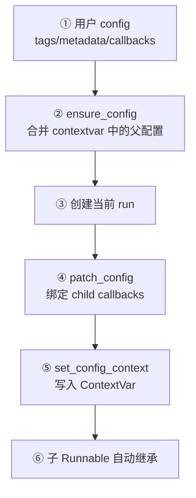
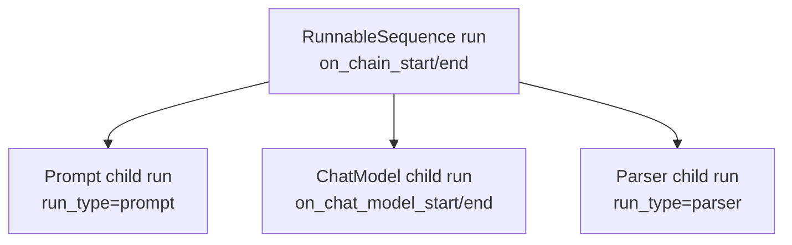
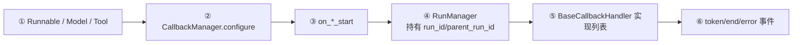
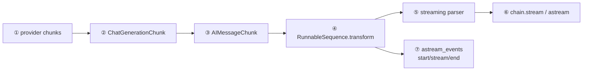
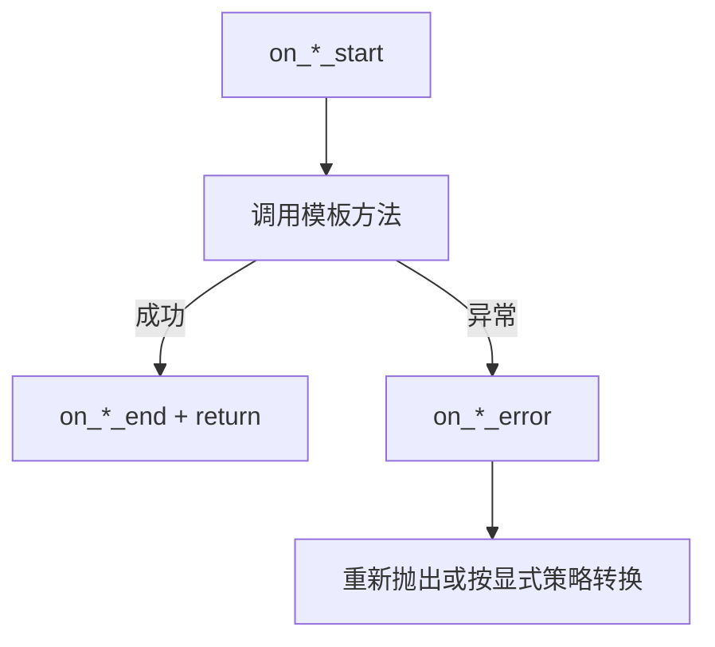
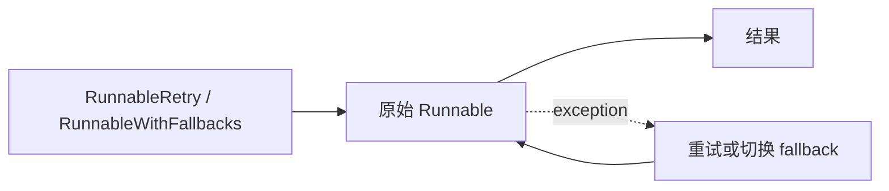
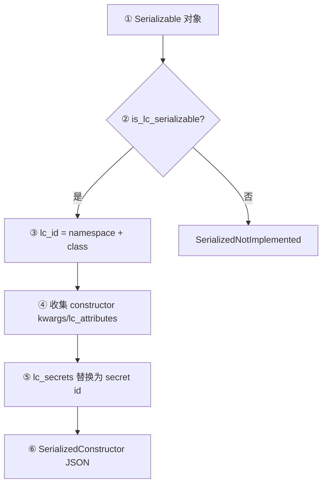

# 07. Config、Callback、缓存、流式与序列化

这些能力横跨 Prompt、Model、Tool、Retriever 和 Chain。它们是源码看起来比业务伪代码复杂很多的主要原因。

## 1. RunnableConfig 的传播

[`RunnableConfig`](../libs/core/langchain_core/runnables/config.py) 不是普通参数模型，而是 `total=False` 的 `TypedDict`，允许只提供部分字段并与父配置合并。



节点源码：

- 类型和字段：[`RunnableConfig`](../libs/core/langchain_core/runnables/config.py)
- 默认值/继承：[`ensure_config`](../libs/core/langchain_core/runnables/config.py)
- 局部修改：[`patch_config`](../libs/core/langchain_core/runnables/config.py)
- 多配置合并：[`merge_configs`](../libs/core/langchain_core/runnables/config.py)
- 上下文传播：[`set_config_context`](../libs/core/langchain_core/runnables/config.py)
- 并发执行器：[`get_executor_for_config`](../libs/core/langchain_core/runnables/config.py)

`tags`、`metadata` 和 callbacks 可继承；`run_name`、`run_id` 通常只描述当前 run。自定义 `configurable` 值可用于运行时切换已声明为 configurable 的字段或备选组件。

## 2. Callback 如何形成调用树

一次 `prompt | model | parser` 的 run 树大致是：



广播过程：



实现入口：

- 事件接口：[`callbacks/base.py`](../libs/core/langchain_core/callbacks/base.py)
- 同步/异步 manager 与各领域 RunManager：[`callbacks/manager.py`](../libs/core/langchain_core/callbacks/manager.py)
- Runnable 公共包装：[`Runnable._call_with_config`](../libs/core/langchain_core/runnables/base.py)
- 控制台展示：[`ConsoleCallbackHandler`](../libs/core/langchain_core/tracers/stdout.py)
- LangSmith tracer：[`LangChainTracer`](../libs/core/langchain_core/tracers/langchain.py)

Callback 是事件机制，Tracer 是消费这些事件并保存/展示运行树的一类 Handler。

## 3. 本地观察调用树

```python
from langchain_core.tracers import ConsoleCallbackHandler

result = chain.invoke(
    {"topic": "Runnable"},
    config={
        "run_name": "source-reading",
        "tags": ["lesson-07"],
        "metadata": {"purpose": "debug"},
        "callbacks": [ConsoleCallbackHandler()],
    },
)
```

全局 debug 开关位于 [`globals.py`](../libs/core/langchain_core/globals.py)，也可 `set_debug(True)`；精确调试更推荐局部 callback，避免所有组件产生大量输出。

## 4. 模型缓存和限流顺序

[`BaseChatModel._generate_with_cache`](../libs/core/langchain_core/language_models/chat_models.py) 的顺序不是偶然的：

```mermaid
flowchart LR
    INPUT["messages + model params"] --> KEY["序列化为 cache key"]
    KEY --> HIT{"cache lookup"]
    HIT -- 命中 --> RETURN["直接返回 generations"]
    HIT -- 未命中 --> RATE["rate_limiter.acquire"]
    RATE --> API["_generate / _stream"]
    API --> UPDATE["cache.update"]
    UPDATE --> RETURN
```

先查缓存、再限流，避免缓存命中也消耗 API 请求许可。

缓存接口：

- [`BaseCache`](../libs/core/langchain_core/caches.py)：`lookup/update/clear` 及异步对应方法；
- [`InMemoryCache`](../libs/core/langchain_core/caches.py)：进程内字典实现；
- 全局缓存 getter/setter：[`globals.py`](../libs/core/langchain_core/globals.py)；
- 限流协议和内存 token bucket：[`rate_limiters.py`](../libs/core/langchain_core/rate_limiters.py)。

缓存 key 需要同时包含规范化 messages 和模型/调用参数，否则不同 temperature、stop 或模型可能错误复用结果。

## 5. 三层“流式”概念

### 5.1 厂商 chunk

OpenAI SDK 返回 provider chunk，[`BaseChatOpenAI._stream/_astream`](../libs/partners/openai/langchain_openai/chat_models/base.py) 将其转换为 `ChatGenerationChunk`，内部承载 `AIMessageChunk`。

### 5.2 模型流

[`BaseChatModel.stream`](../libs/core/langchain_core/language_models/chat_models.py) 管理 callback、message id、token 事件和最终 chunk；非流式调用也可能在 `_generate_with_cache` 中聚合 `_stream` 结果。

### 5.3 Chain/事件流



源码：

- 消息 chunk 合并：[`messages/base.py`](../libs/core/langchain_core/messages/base.py)、[`messages/ai.py`](../libs/core/langchain_core/messages/ai.py)
- generation chunk：[`outputs/chat_generation.py`](../libs/core/langchain_core/outputs/chat_generation.py)
- sequence 流转换：[`RunnableSequence`](../libs/core/langchain_core/runnables/base.py)
- 流式 parser：[`output_parsers/transform.py`](../libs/core/langchain_core/output_parsers/transform.py)
- 事件 schema：[`runnables/schema.py`](../libs/core/langchain_core/runnables/schema.py)
- event stream 实现：[`tracers/event_stream.py`](../libs/core/langchain_core/tracers/event_stream.py)

`stream` 返回业务输出 chunk；`astream_events` 返回带 `event/name/run_id/tags/metadata/data` 的运行事件，两者用途不同。

## 6. 错误如何传播

各公共入口遵循同一模式：



- Runnable：[`_call_with_config`](../libs/core/langchain_core/runnables/base.py)
- Model：[`BaseChatModel.generate`](../libs/core/langchain_core/language_models/chat_models.py)
- Tool：[`BaseTool.run`](../libs/core/langchain_core/tools/base.py)
- Retriever：[`BaseRetriever.invoke`](../libs/core/langchain_core/retrievers.py)

Tool 是一个特殊点：只有配置了 `handle_validation_error` 或 `handle_tool_error` 时，特定异常才会转换为 error content；其他异常仍回调后抛出。

## 7. Retry 与 Fallback 是装饰，不侵入组件

Runnable 可通过绑定包装增加能力：

- `with_retry`：实现位于 [`runnables/retry.py`](../libs/core/langchain_core/runnables/retry.py)；
- `with_fallbacks`：实现位于 [`runnables/fallbacks.py`](../libs/core/langchain_core/runnables/fallbacks.py)；
- `with_config` / bind：实现在 [`RunnableBinding`](../libs/core/langchain_core/runnables/base.py)。



Agent 的 model/tool retry middleware 是图编排层版本，见 [`agents/middleware/model_retry.py`](../libs/langchain_v1/langchain/agents/middleware/model_retry.py) 和 [`tool_retry.py`](../libs/langchain_v1/langchain/agents/middleware/tool_retry.py)。

## 8. 序列化与 secret

[`Serializable`](../libs/core/langchain_core/load/serializable.py) 继承 Pydantic `BaseModel`，但**继承并不等于默认允许序列化**；子类需显式让 `is_lc_serializable()` 返回 `True`。



节点源码：

- 对象转结构：[`Serializable.to_json`](../libs/core/langchain_core/load/serializable.py)
- 字符串 dump：[`load/dump.py`](../libs/core/langchain_core/load/dump.py)
- 受控 reviver/load：[`load/load.py`](../libs/core/langchain_core/load/load.py)
- 兼容类路径映射：[`load/mapping.py`](../libs/core/langchain_core/load/mapping.py)

secret 只序列化为标识符，不应把真实 key 写入 JSON。反序列化也不是任意 Python import；它通过允许的 namespace/mapping 和显式配置控制可加载类型。

## 9. 运行时排查清单

| 问题 | 第一断点 | 观察值 |
|---|---|---|
| tags/metadata 丢失 | `ensure_config` | 父 context 和合并后的 config |
| trace 没有子节点 | `patch_config` | `callbacks=run_manager.get_child(...)` |
| 模型没发请求 | `_generate_with_cache` | `llm_cache`、`cache_val` |
| 限流看似无效 | `_generate_with_cache` | 是否缓存命中、是否设置 `rate_limiter` |
| stream 最后一次性输出 | `RunnableSequence._transform` | 哪个 step 没有 transform |
| Tool 错误没抛出 | `BaseTool.run` | `handle_validation_error/handle_tool_error` |
| 序列化得到 not_implemented | `Serializable.to_json` | `is_lc_serializable()` |

