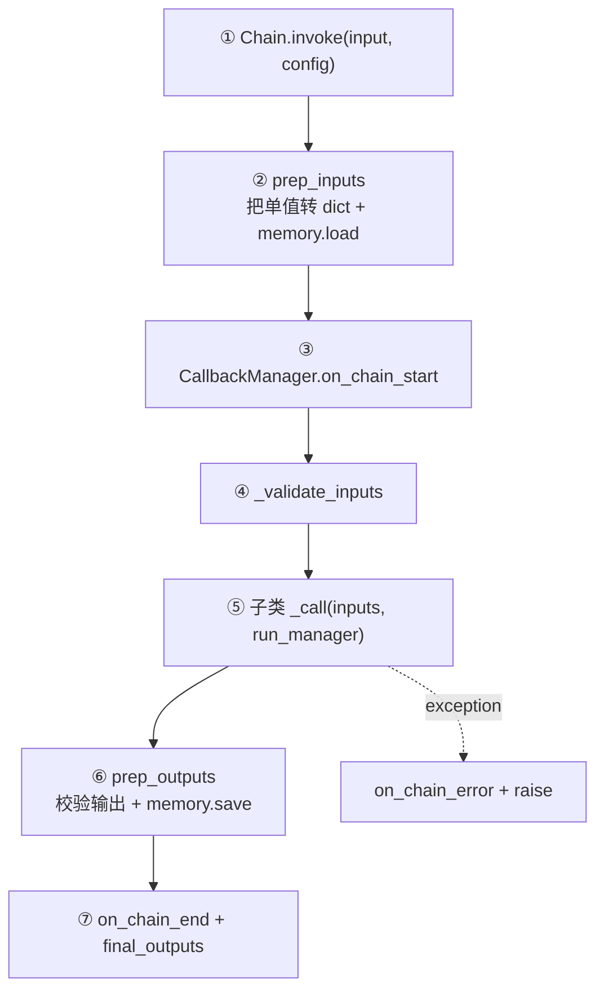
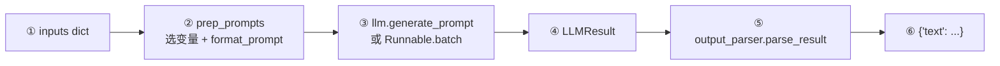
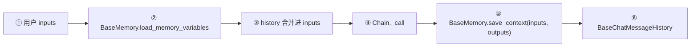
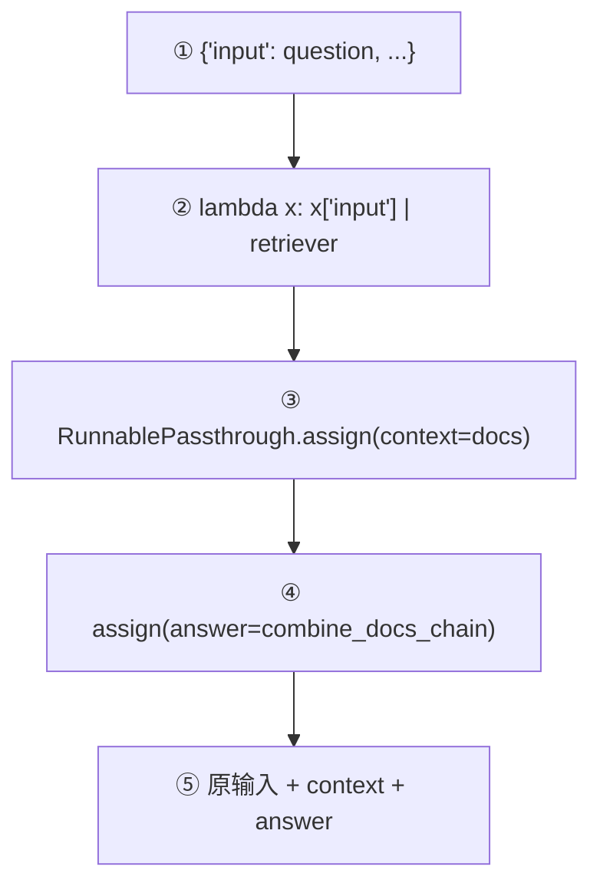

# 10. `langchain-classic` 旧版模块附录

这部分用于读懂旧教程和维护旧项目，不建议作为新项目设计模板。当前仓库把旧实现放在 [`libs/langchain/langchain_classic`](../libs/langchain/langchain_classic)，包名为 `langchain-classic`。

## 1. 为什么它仍然值得认识

旧版以大量专用 `Chain`、旧 Agent Executor 和 Chain Memory 为中心；新版更多使用 LCEL Runnable、`create_agent` + LangGraph 状态/checkpointer/store。许多网上文章仍使用：

```python
LLMChain(...)
ConversationBufferMemory(...)
RetrievalQA.from_chain_type(...)
```

看懂旧源码的目标是建立迁移映射，而不是背下所有专用 Chain。

## 2. 旧版模块地图

| 模块 | 作用 | 源码入口 | 新版思路 |
|---|---|---|---|
| `chains` | 每种业务流一个 Chain 类/工厂 | [`chains`](../libs/langchain/langchain_classic/chains) | LCEL 组合或 Agent Graph |
| `agents` | 旧 Agent/AgentExecutor/解析器 | [`agents`](../libs/langchain/langchain_classic/agents) | [`langchain.agents.create_agent`](../libs/langchain_v1/langchain/agents/factory.py) |
| `memory` | Chain 调用前加载、调用后保存 | [`memory`](../libs/langchain/langchain_classic/memory) | Agent checkpointer/store 或显式 message history |
| `retrievers` | 特殊检索器/压缩器 | [`retrievers`](../libs/langchain/langchain_classic/retrievers) | core `BaseRetriever` + 集成包 |
| `document_loaders` | 大量旧 loader 路径/兼容入口 | [`document_loaders`](../libs/langchain/langchain_classic/document_loaders) | 具体集成包/社区包 |
| `tools` | 大量具体服务工具 | [`tools`](../libs/langchain/langchain_classic/tools) | core Tool 协议 + 独立集成 |
| `evaluation` | QA、criteria、距离等评估器 | [`evaluation`](../libs/langchain/langchain_classic/evaluation) | 仍可维护旧评估流，观测可结合 LangSmith |
| `schema` / `prompts` / `output_parsers` | 多为历史导出与兼容实现 | 对应目录 | 优先从 `langchain_core` 导入 |

## 3. 旧 `Chain.invoke` 流程

[`Chain`](../libs/langchain/langchain_classic/chains/base.py) 本身继承 `RunnableSerializable`，因此旧 Chain 也接入了 Runnable 协议，但内部保留 Chain 特有的 dict input/output 和 memory 生命周期。



节点都位于 [`chains/base.py`](../libs/langchain/langchain_classic/chains/base.py)：`Chain.invoke`、`prep_inputs`、`_validate_inputs`、抽象 `_call`、`prep_outputs`。

它与 core 模板模式完全一致：公共入口处理校验/memory/callback，具体 Chain 实现 `_call`。

## 4. `LLMChain` 的旧流程与 LCEL 对照

[`LLMChain`](../libs/langchain/langchain_classic/chains/llm.py) 已在源码中标记 deprecated。其流程：



节点：

- Chain 包装：[`LLMChain._call`](../libs/langchain/langchain_classic/chains/llm.py)
- Prompt 准备：[`LLMChain.prep_prompts`](../libs/langchain/langchain_classic/chains/llm.py)
- 模型批量调用：[`LLMChain.generate`](../libs/langchain/langchain_classic/chains/llm.py)
- 结果构造：同文件 `create_outputs`

等价的新版主线通常更直接：

```python
chain = prompt | model | output_parser
```

LCEL 减少了专用包装类，并自动继承 sync/async/batch/stream。

## 5. 旧 Chain Memory 生命周期



源码节点：

- 抽象协议：[`BaseMemory`](../libs/langchain/langchain_classic/base_memory.py)
- Chain 注入/保存位置：[`Chain.prep_inputs/prep_outputs`](../libs/langchain/langchain_classic/chains/base.py)
- Chat input/output 转消息：[`BaseChatMemory`](../libs/langchain/langchain_classic/memory/chat_memory.py)
- 全量 buffer：[`ConversationBufferMemory`](../libs/langchain/langchain_classic/memory/buffer.py)
- Message history 的当前 core 抽象：[`chat_history.py`](../libs/core/langchain_core/chat_history.py)

源码对 `BaseChatMemory` 有明确警告：它早于原生 tool calling，不适合新 Tool-calling Agent，可能无法正确保存复杂工具消息。新版 Agent 短期状态应理解为图 state + checkpointer，跨会话数据使用 store。

## 6. 旧 Retrieval Chain 中已经使用 LCEL

不是 classic 里的所有代码都采用旧式 class。[`create_retrieval_chain`](../libs/langchain/langchain_classic/chains/retrieval.py) 已用 Runnable 组合：



源码实现只有一个小工厂函数，说明 LCEL 能用组合替代大量样板类。

旧的 [`RetrievalQA`](../libs/langchain/langchain_classic/chains/retrieval_qa/base.py) 则是专用 `Chain` 子类：`_call` 内先 `_get_docs`，再调用 combine documents chain。读旧项目时可用这一区别判断其年代与迁移难度。

## 7. 旧 Agent 与新版 Agent 的概念映射

| 旧概念 | 新概念 |
|---|---|
| Agent 产出 `AgentAction/AgentFinish` | `AIMessage.tool_calls` / 无 tool call 的最终消息 |
| `AgentExecutor` 手写执行循环 | 编译后的 StateGraph 条件边 |
| `intermediate_steps` | `AgentState.messages` 中 AI/Tool 消息 |
| OutputParser 解析文本动作 | 模型原生 tool calling + 标准 ToolCall |
| Chain Memory | checkpointer/store/state schema |
| callbacks | 仍沿用 core callbacks/config 体系 |

旧 Agent 目录入口：[`langchain_classic/agents`](../libs/langchain/langchain_classic/agents)；新版循环入口：[`create_agent`](../libs/langchain_v1/langchain/agents/factory.py)。

## 8. 遇到旧教程时的判断规则

- 导入路径含 `langchain_classic`：明确是兼容包。
- 使用 `LLMChain`、`.run()`、`__call__()`：优先找 `invoke`/LCEL 替代；源码中 `__call__` 已标记 deprecated。
- 使用 `ConversationBufferMemory` 搭配工具 Agent：不要照搬到新项目。
- 使用 `RetrievalQA`：先理解它的 retrieve→combine 流程，再改写为 LCEL 或 `create_retrieval_chain`。
- 具体 loader/tool 在 classic 中并不代表它仍是推荐集成位置，应查看当前独立集成包。

## 9. 推荐阅读范围

只精读以下四个文件即可建立旧版全局模型：

1. [`chains/base.py`](../libs/langchain/langchain_classic/chains/base.py)：所有旧 Chain 的生命周期。
2. [`chains/llm.py`](../libs/langchain/langchain_classic/chains/llm.py)：最经典且已 deprecated 的包装。
3. [`chains/retrieval.py`](../libs/langchain/langchain_classic/chains/retrieval.py)：LCEL 风格替代。
4. [`memory/chat_memory.py`](../libs/langchain/langchain_classic/memory/chat_memory.py)：旧 memory 的限制。

其余数百个 Chain/Tool 按需求查阅，不必线性通读。

