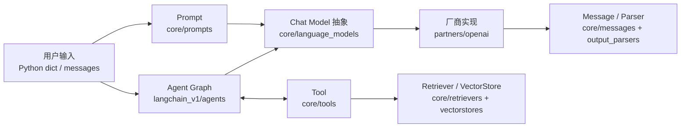

# LangChain 源码学习手册（Python 新手版）

这套文档不是 API 使用说明，而是一张“从会用到看懂实现”的源码地图。所有结论都以本仓库当前源码为准，关键流程节点均给出实现类/函数和可点击的源码链接。

## 先明确本仓库中的三个 LangChain

| 层次 | 目录 | 当前包名 | 学习定位 |
|---|---|---|---|
| 抽象层 | [`libs/core`](../libs/core) | `langchain-core` | 最重要。Runnable、消息、模型抽象、Prompt、Tool、Retriever 等都在这里 |
| 新版高层 API | [`libs/langchain_v1`](../libs/langchain_v1) | `langchain` | 当前主线。重点是 Agent、模型初始化、中间件和结构化输出 |
| 旧版实现 | [`libs/langchain`](../libs/langchain) | `langchain-classic` | 兼容旧项目，不建议作为第一条学习主线 |
| 厂商适配层 | [`libs/partners`](../libs/partners) | `langchain-openai` 等 | 学习抽象如何落到真实 SDK/API |

当前源码声明的版本基线：`langchain==1.3.14`、`langchain-core==1.4.9`、`langchain-openai==1.3.5`，Python 要求为 `>=3.10,<4.0`。版本定义见各包的 `pyproject.toml`，以后更新源码时这里可能变化。

## 推荐阅读顺序

1. [本地运行与调试](01-local-run-and-debug.md)：先让源码可导入、测试可单步执行。
2. [整体架构与模块地图](02-architecture-and-module-map.md)：建立“接口层—实现层—编排层”的全局模型。
3. [Runnable 与 LCEL](03-runnable-and-lcel.md)：理解 LangChain 最核心的统一协议和 `|` 运算符。
4. [Prompt、Message、Model、OutputParser](04-prompt-message-model-parser.md)：跟踪一次普通 Chain 调用。
5. [Agent、Tool 与 Middleware](05-agent-tool-middleware.md)：理解模型—工具循环和图编排。
6. [Document、Embedding、VectorStore、Retriever 与 RAG](06-retrieval-and-rag.md)：理解检索链路。
7. [Config、Callback、缓存、流式与序列化](07-runtime-cross-cutting.md)：理解为什么每个调用都能被观测和扩展。
8. [源码阅读实验](08-reading-labs.md)：通过断点和小实验验证前面的结论。
9. [源码符号速查表](09-source-index.md)：按模块快速找到入口、模板方法和具体实现。
10. [`langchain-classic` 旧版附录](10-langchain-classic-appendix.md)：读懂旧教程并建立迁移映射。

## 一张图看懂学习主线



这里最值得先记住的四个思想：

1. **面向接口编程**：`BaseChatModel`、`BaseTool`、`BaseRetriever` 规定稳定协议，厂商包只实现少数模板方法。
2. **统一成 Runnable**：Prompt、Model、Parser、Tool、Retriever 都可以 `invoke/ainvoke/batch/stream`，所以能用 `|` 组合。
3. **配置沿调用树传播**：callbacks、tags、metadata、并发参数不是业务数据，而是通过 `RunnableConfig` 形成父子运行树。
4. **Agent 是有状态循环，不是普通顺序 Chain**：模型决定是否调用工具，工具结果写回消息，再由模型继续判断，直到满足退出条件。

## 阅读源码时的标记约定

文档中的流程节点采用如下格式：

```text
节点含义
源码文件::类或函数
```

例如 `runnables/base.py::RunnableSequence.invoke` 表示应打开文件后搜索 `class RunnableSequence`，再在类内搜索 `def invoke`。使用“文件 + 符号”而不是固定行号，是因为行号会随代码更新漂移。

## 适合 Python 新手的阅读方法

- 第一遍只看类名、函数签名、返回值和流程图，不要试图看懂每个类型参数。
- 第二遍重点跟 `invoke`，暂时跳过 `ainvoke/astream`；异步版本通常是相同结构的异步实现或线程池兜底。
- 遇到 `@abstractmethod`，说明这里是协议，要继续找子类对该方法的实现。
- 遇到 Pydantic `BaseModel`，先把它理解为“带校验、序列化能力的数据类”。
- 遇到 `Generic[Input, Output]`，先理解成“这个组件声明输入和输出类型”。
- 每读完一节都运行 [源码阅读实验](08-reading-labs.md)，用对象类型和调用栈验证猜想。

## 本手册的覆盖边界

“每个模块”在这里指当前主线中承担核心运行职责的模块族，而不是逐文件解释数千个工具函数。已覆盖：

- `langchain-core`：runnables、prompts、prompt values、messages、language models、outputs、output parsers、tools、documents、embeddings、vectorstores、retrievers、callbacks、tracers、load/serialization、caches/rate limiters（作为横切能力）。
- `langchain`：agents、middleware、structured output、chat model/embedding 初始化、tools 兼容入口。
- partner 示例：`langchain-openai` 的请求组装、SDK 调用、响应转换、流式转换。

`langchain-classic` 以附录形式讲解公共生命周期与迁移映射，但不逐一展开其数百个专用 Chain/Tool；每个合作方的参数差异和 LangGraph 内部调度器也不做逐文件展开。遇到主流程跨到这些边界时，文档会明确标注。
